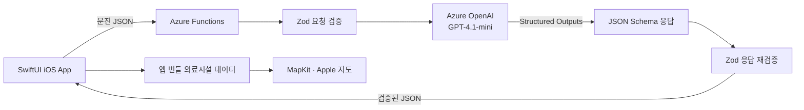

# APAYO (아파요) 🌾

> **JunctionX Korea 2026 · Microsoft × 경상북도 Track**
> 외국인 계절근로자의 “아파요”를 한국 의료진이 이해하고 대응할 수 있는 구조화된 의료정보로 바꿉니다.

APAYO는 경상북도 농업 현장의 외국인 계절근로자를 위한 **다국어 AI 문진 iOS 앱**입니다. 사용자가 모국어로 입력한 증상과 문진 답변을 정리하고, 증상에서 빠진 정보와 농작업 환경을 확인하는 맞춤형 체크 항목을 생성합니다. 최종 결과는 사용자 언어와 의료진용 한국어로 함께 제공되며, 가까운 병·의원과 약국 탐색 및 길찾기까지 연결됩니다.

APAYO는 의료 진단이나 약 처방을 제공하지 않습니다. 사용자가 직접 입력하고 선택한 정보를 구조화하여 의료진과의 의사소통을 돕는 서비스입니다.

## 문제 정의

경상북도는 고령화와 인구 감소로 농업 분야의 외국인 계절근로자 의존도가 높아지고 있습니다. 그러나 계절근로자는 언어 장벽과 의료정보 부족, 농촌 지역의 이동 제약 때문에 증상을 정확히 설명하거나 적절한 의료시설을 찾기 어렵습니다.

일반적인 번역·증상 선택 서비스는 사용자가 말한 내용을 전달하는 데 그치기 쉽습니다. APAYO는 입력된 증상과 기본 문진을 바탕으로 **아직 확인되지 않은 맥락을 추가로 수집**하고, 고온·장시간 노동·수분 부족·농약 노출과 같은 **농업 작업환경을 놓치지 않도록 설계**했습니다.

## 주요 사용자 흐름

1. **언어 및 기본 건강정보 등록**
   기저질환, 알레르기, 수술 이력 등 의료진에게 필요한 기본 정보를 입력합니다.
2. **모국어 증상 입력**
   사용자는 익숙한 언어로 현재 증상을 자유롭게 작성합니다.
3. **기본 문진 진행**
   증상 기간, 빈도, 통증 강도, 동반 증상, 복용 약 등을 선택합니다.
4. **AI 기반 추가 확인**
   AI가 증상과 기존 답변에서 빠진 맥락을 2~4개의 체크 문장으로 생성합니다.
5. **다국어·한국어 문진 결과 생성**
   증상에 맞는 그림 카드와 사용자 언어 요약, 의료진용 한국어 요약을 제공합니다.
6. **주변 의료시설 연결**
   현재 위치에서 가까운 병·의원과 약국을 지도에 표시하고 Apple 지도 길찾기로 연결합니다.

증상을 입력하기 전에도 **“어떻게 해야 할지 모르겠어요”** 기능을 통해 상황별 도움말과 이용 가능한 의료시설을 먼저 확인할 수 있습니다.

## 핵심 기능

### 다국어 의료 접근

- 영어, 필리핀어, 베트남어, 중국어(간체), 러시아어, 크메르어 지원
- 사용자가 선택한 언어로 앱 화면과 AI 추가 확인 문장 제공
- 최종 문진 결과를 사용자 언어와 한국어로 전환하여 확인

### 농업 특화 AI 문진

Azure OpenAI는 증상만 요약하지 않고 다음과 같은 계절 농업 근로자의 작업 맥락을 추가로 확인합니다.

- 야외 또는 비닐하우스 작업
- 고온 및 직사광선 노출
- 장시간 작업
- 휴식 또는 수분 섭취 부족
- 환기가 어려운 공간
- 농약 및 화학물질 노출
- 농기계 작업, 낙상 및 외상
- 벌레 물림 또는 쏘임

사용자가 작업환경을 처음부터 언급하지 않더라도 추가 문진에 **농작업 관련 체크 항목이 최소 1개 포함**되도록 서버 프롬프트와 응답 스키마, iOS 검증 로직으로 보장합니다. 사용자가 선택한 작업 맥락은 최종 의료진용 한국어 문진 결과에도 반영됩니다.

### 안전한 구조화 출력

- Azure OpenAI Structured Outputs의 JSON Schema 사용
- Azure Functions에서 요청과 AI 응답을 Zod 스키마로 검증
- 허용된 그림 카드 ID와 응답 형식만 앱에 전달
- 프롬프트 인젝션 방어를 위해 사용자 입력을 명령이 아닌 데이터로 취급
- 진단, 질병 확률 추정, 약 추천 및 치료 지시 금지

### 의료시설 탐색

- 경상북도 병·의원과 약국을 한 데이터셋으로 통합
- 사용자 위치를 기준으로 가까운 순서 정렬
- 병·의원과 약국 구분, 기관명·주소·전화번호·진료과목 제공
- MapKit 지도 표시 및 Apple 지도 길찾기 연동

## Microsoft 기술 활용

| 기술 | 활용 방식 |
| --- | --- |
| **Microsoft Foundry** | GPT-4.1-mini 모델 배포, Playground 프롬프트 테스트, 할당량 및 사용량 관리 |
| **Azure OpenAI** | 다국어 증상 구조화, 맥락 기반 추가 체크 문장 생성, 의료진용 한국어 요약, 증상 그림 카드 ID 선택 |
| **Azure Functions** | iOS 앱과 Azure OpenAI 사이의 얇은 API 프록시, 요청 검증, 프롬프트 구성, 응답 재검증 및 API 키 보호 |

## 시스템 아키텍처



API 키는 iOS 앱에 포함하지 않고 Azure Functions의 환경변수로만 관리합니다.

## AI 처리 흐름

APAYO의 AI 호출은 사용자 흐름에 따라 분리되어 있습니다.

1. **증상 분석**: 자유 입력에서 증상과 신체 부위를 구조화합니다.
2. **추가 확인 항목 생성**: 기본 문진 답변을 바탕으로 아직 부족한 정보와 농작업 맥락을 체크 문장으로 생성합니다.
3. **최종 문진 요약**: 선택된 추가 항목까지 종합하여 사용자 언어 및 한국어 요약을 생성하고 그림 카드 ID를 선택합니다.

## 공공데이터 활용

의료시설 안내에는 건강보험심사평가원의 병원정보서비스, 약국정보서비스, 의료기관별 진료과목정보를 활용했습니다. 서로 분리된 데이터를 `암호화요양기호`를 기준으로 결합하고 경상북도 시설만 선별한 뒤, 좌표·주소·전화번호·진료과목의 형식과 결측치를 검증했습니다.

| 구분 | 시설 수 |
| --- | ---: |
| 병·의원 | 3,415개 |
| 약국 | 1,141개 |
| **합계** | **4,556개** |

정제된 데이터는 앱 번들에 포함되며, 사용자의 현재 위치와 시설 좌표를 비교해 가까운 순서로 제공합니다. 데이터 변환 방법은 [DataPipeline/README.md](DataPipeline/README.md)에서 확인할 수 있습니다.

## 기술 스택

| 영역 | 기술 |
| --- | --- |
| iOS | Swift, SwiftUI, MapKit, Core Location |
| AI | Azure OpenAI, GPT-4.1-mini, Structured Outputs |
| Server | Azure Functions v4, TypeScript, Node.js, Zod |
| Data | 건강보험심사평가원 공공데이터, Python 데이터 변환 파이프라인 |
| Design | Figma |

## 프로젝트 구조

```text
APAYO/
├── APAYO/                 # SwiftUI iOS 애플리케이션
│   ├── App/               # 앱 진입점
│   ├── Core/              # 디자인 시스템과 다국어 처리
│   ├── Data/              # 네트워크·로컬 데이터·서비스
│   ├── Domain/            # 요청/응답 및 문진 도메인 모델
│   ├── Features/          # 온보딩·문진·요약·시설 검색 화면
│   └── Resources/         # 번역, 그림 카드, 질문 및 의료시설 JSON
├── Server/                # Azure Functions API 프록시
│   ├── src/ai/            # 프롬프트와 Azure OpenAI 호출
│   ├── src/contracts/     # API 계약
│   ├── src/functions/     # HTTP 엔드포인트
│   └── src/validation/    # Zod 요청/응답 검증
├── DataPipeline/          # 의료시설 XLSX 정제·통합 도구
└── Docs/                  # AI 계약 및 Git 규칙
```

## 로컬 실행

### 준비 사항

- macOS와 Xcode
- Node.js 18 이상
- Azure Functions Core Tools v4
- Azurite 또는 연결 가능한 Azure Storage
- Azure OpenAI 리소스 및 배포된 GPT-4.1-mini 모델

### 1. 서버 설정

```bash
cd Server
npm install
```

`Server/local.settings.json`을 생성하고 본인의 Azure 값으로 설정합니다. 이 파일에는 비밀키가 포함되므로 Git에 커밋하지 않습니다.

```json
{
  "IsEncrypted": false,
  "Values": {
    "AzureWebJobsStorage": "UseDevelopmentStorage=true",
    "FUNCTIONS_WORKER_RUNTIME": "node",
    "AZURE_OPENAI_ENDPOINT": "https://YOUR-RESOURCE.openai.azure.com",
    "AZURE_OPENAI_API_KEY": "YOUR_API_KEY",
    "AZURE_OPENAI_DEPLOYMENT": "YOUR_DEPLOYMENT_NAME"
  }
}
```

### 2. 로컬 Functions 실행

```bash
cd Server
npm start
```

서버가 실행되면 상태 확인 API를 호출할 수 있습니다.

```bash
curl http://127.0.0.1:7071/api/health
```

### 3. iOS 앱 실행

1. Xcode에서 `APAYO.xcodeproj`를 엽니다.
2. APAYO Scheme과 iPhone Simulator를 선택합니다.
3. 실행 환경에 `APAYO_API_BASE_URL`을 설정하면 API 주소를 덮어쓸 수 있습니다.
4. 앱을 빌드하고 실행합니다.

로컬 Functions를 사용할 때의 API 주소는 다음과 같습니다.

```text
http://127.0.0.1:7071/api
```

> Azure 리소스가 중지된 상태에서는 배포 서버를 통한 AI 기능이 동작하지 않습니다. 로컬 실행 시에도 유효한 Azure OpenAI 설정이 필요합니다.

## API 엔드포인트

| Method | Endpoint | 설명 |
| --- | --- | --- |
| `GET` | `/api/health` | Functions 상태 확인 |
| `POST` | `/api/v1/symptom-analysis` | 자유 입력 증상 구조화 |
| `POST` | `/api/v2/follow-up-questions` | 맥락 기반 추가 체크 문장 생성 |
| `POST` | `/api/v2/medical-interview-summary` | 다국어·한국어 문진 요약 및 그림 카드 선택 |

자세한 요청·응답 계약은 [Docs/AI_CONTRACT.md](Docs/AI_CONTRACT.md)를 참고하세요.

## 팀 PADM

| Member | Role | Responsibility |
| --- | --- | --- |
| Myong | Developer | SwiftUI UI, 지도 연동, 다국어 현지화 및 언어 상태 관리, 공공데이터 전처리 파이프라인, JSON 모델링 및 비동기 데이터 로딩  |
| Ahae | Developer | SwiftUI UI, AI 파이프라인, Azure Functions, 데이터 모델 및 문진 흐름 |
| Pony | UI/UX Designer | 다국어 사용자 경험과 문진 UI/UX 설계, 브랜딩 및 피치덱 |
| Ddoechii | UI/UX Designer | 증상 입력 경험 설계, 의료진용 결과 화면, 브랜딩 및 피치덱 |

## License

This project is licensed under the [MIT License](LICENSE).
